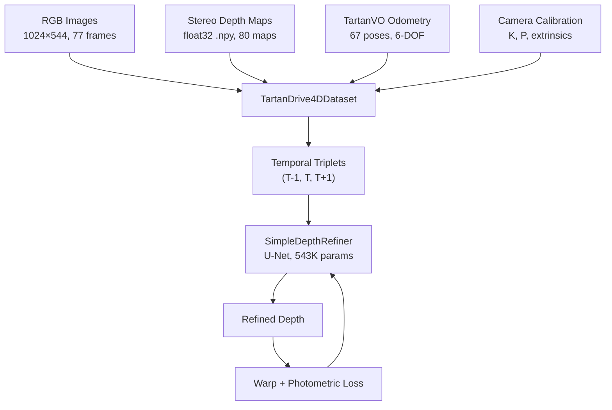
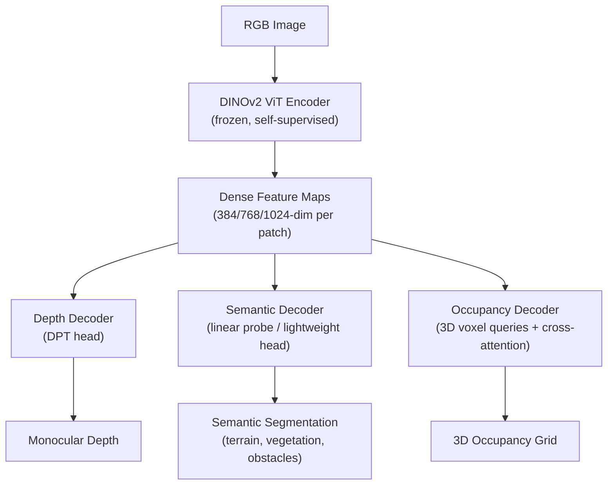

# Self-Supervised 4D Occupancy Projection Pipeline

## Overview

This document describes the **self-supervised 4D occupancy projection pipeline** built for the TartanDrive 2.0 dataset. The goal is to predict dense 3D occupancy from monocular RGB video — without any manual 3D labels — by exploiting **photometric consistency** across time as the supervisory signal.

The pipeline processes image sequences from an off-road UGV (Unmanned Ground Vehicle), leveraging stereo-derived depth, TartanVO odometry, and camera calibration to project frames through 3D space and train a depth/occupancy model entirely self-supervised.

---

## 1. Pipeline Architecture

```
  Frame T-1          Frame T           Frame T+1
     │                  │                  │
     │            ┌─────┴─────┐            │
     │            │  Depth    │            │
     │            │  Refiner  │            │
     │            │  Network  │            │
     │            └─────┬─────┘            │
     │                  │                  │
     │            Predicted Depth          │
     │                  │                  │
     │         ┌────────┴────────┐         │
     │         │   Backproject   │         │
     │         │   D·K⁻¹·[u,v,1]│          │
     │         └────────┬────────┘         │
     │              3D Points              │
     │                  │                  │
     │    ┌─────────────┼─────────────┐    │
     │    │ Transform via Relative    │    │
     │    │ Pose (TartanVO Odometry)  │    │
     │    └──────┬──────┴──────┬──────┘    │
     │           │             │           │
     │     Reproject      Reproject        │
     │     to T-1         to T+1           │
     │           │             │           │
     ▼           ▼             ▼           ▼
  Source ──► Grid Sample   Grid Sample ◄── Source
  Image       Warp T-1       Warp T+1     Image
                 │             │
                 └──────┬──────┘
                        │
              min(Photometric Loss)
                  SSIM + L1
                        │
                   Backprop
```

### Core Math

The projection from pixel coordinates to world coordinates:

$$P_{world} = T_{v \to w} \cdot T_{c \to v} \cdot \left( D \cdot K^{-1} \cdot \begin{bmatrix} u \\ v \\ 1 \end{bmatrix} \right)$$

For photometric consistency, we compute the **relative transform** between two camera frames and warp one view into the other:

$$T_{rel} = T_{v \to c} \cdot T_{tgt}^{-1} \cdot T_{src} \cdot T_{c \to v}$$

| Symbol | Meaning | Source |
|--------|---------|--------|
| $K$ | Camera intrinsic matrix (3×3) | `multisense_intrinsics.txt` |
| $D$ | Depth (meters per pixel) | Stereo SGBM → refined by network |
| $T_{c \to v}$ | Camera-to-vehicle transform (static) | `extrinsics.yaml` |
| $T_{v \to w}$ | Vehicle-to-world pose (per frame) | `tartanvo_odom.csv` |

---

## 2. Data Flow



### Transform Chain

```
vehicle → multisense/head → multisense/left_camera_optical_frame
   │            │                        │
   └── extrinsics.yaml ─────────────────┘
```

Poses from `tartanvo_odom.csv` provide `T_vehicle_to_world` per timestep. Combined with the static extrinsics, this gives the full camera-to-world transform for any frame.

---

## 3. Loss Functions

### Photometric Consistency (Primary)
$$\mathcal{L}_{photo} = \alpha \cdot \frac{1 - \text{SSIM}(I_{warped}, I_{target})}{2} + (1-\alpha) \cdot |I_{warped} - I_{target}|$$

- $\alpha = 0.85$ (SSIM-weighted)
- Applied only to valid pixels (depth > 0, within image bounds)
- **Minimum reprojection**: $\min(\mathcal{L}_{prev}, \mathcal{L}_{next})$ handles occlusions

### Edge-Aware Smoothness (Regularizer)
$$\mathcal{L}_{smooth} = |\partial_x d| \cdot e^{-|\partial_x I|} + |\partial_y d| \cdot e^{-|\partial_y I|}$$

Penalizes depth discontinuities except at image edges (likely object boundaries).

---

## 4. Current Implementation

| Component | Implementation | File |
|-----------|---------------|------|
| Depth prediction | `SimpleDepthRefiner` — 3-level U-Net | `pipeline_4d.py` |
| Backbone | Conv2d encoder (32→64→128) | `pipeline_4d.py` |
| Depth activation | Softplus (guarantees positive) | `pipeline_4d.py` |
| Warping | Differentiable grid_sample | `pipeline_4d.py` |
| Optimizer | Adam, lr=1e-4 | `pipeline_4d.py` |
| Training | 10 epochs, batch_size=2 | `pipeline_4d.py` |
| Result | Loss: 0.395 → 0.347 | CPU, ~15min |

---

## 5. Roadmap: Improvements and Next Steps

### Phase 1 — Immediate Improvements

| Improvement | Description | Impact |
|------------|-------------|--------|
| **CUDA training** | Install `torch+cu124`, train on RTX 4060 | 10-50× speedup |
| **More data** | Load additional TartanDrive 2.0 sequences | Better generalization |
| **Data augmentation** | Color jitter, random crop, horizontal flip | Regularization |
| **Multi-scale loss** | Compute photometric loss at 4 resolutions | Captures coarse + fine details |
| **Auto-masking** | Mask static pixels where $\mathcal{L}_{photo}(warped) > \mathcal{L}_{photo}(unwarped)$ | Handles static scenes |

### Phase 2 — Architecture Upgrade to QueryOcc

Replace the simple U-Net with a **query-based 3D occupancy architecture** (inspired by SelfOcc, Let Occ Flow):

```
  Image Features ──► 3D Voxel Queries ──► Cross-Attention ──► Occupancy Grid
       │                                                           │
   2D Backbone                                               Volume Rendering
   (DINOv2)                                                        │
                                                           Rendered Depth + RGB
                                                                   │
                                                          Photometric Loss
```

Key components:
1. **3D Voxel Query Grid** — learnable queries at each voxel position
2. **Deformable Cross-Attention** — queries attend to image features
3. **Volume Rendering** — differentiable rendering of occupancy → depth
4. **Temporal Fusion** — attention across multiple timesteps

### Phase 3 — Foundation Model Integration (see Section 6)

---

## 6. Self-Supervised Foundation Models for Depth & Semantics

### The Vision: DINOv2 as Universal Feature Backbone

Self-supervised Vision Transformers (ViTs) like **DINOv2** learn rich visual representations without any labels. These features encode both **geometric (depth)** and **semantic (object class)** information — making them ideal backbones for off-road occupancy prediction.



### Why DINOv2 Works for This Pipeline

| Capability | How It Helps |
|-----------|-------------|
| **Self-supervised pretraining** | No labeled data needed — matches our self-supervised philosophy |
| **Dense features** | Per-patch features at multiple scales, ideal for pixel-level prediction |
| **Semantic awareness** | Features naturally cluster by object type (shown via PCA visualization) |
| **Depth awareness** | Features encode geometric structure — proven by Depth Anything V2 |
| **Domain robustness** | Strong generalization to out-of-distribution scenes (off-road, adverse weather) |
| **Open-source** | Available as `facebookresearch/dinov2` on PyTorch Hub |

### Integration Strategy: DINOv2 → Depth + Semantics + Occupancy

#### Step 1: Replace CNN Backbone with DINOv2

```python
import torch

# Load frozen DINOv2 backbone
dinov2 = torch.hub.load('facebookresearch/dinov2', 'dinov2_vitb14')
dinov2.eval()

# Extract dense features from an image
with torch.no_grad():
    # Input: (B, 3, H, W), H and W must be divisible by 14
    features = dinov2.forward_features(image)
    patch_tokens = features["x_norm_patchtokens"]  # (B, N_patches, 768)
    # Reshape to spatial grid: (B, 768, H//14, W//14)
```

#### Step 2: Depth Estimation via Depth Anything V2

**Depth Anything V2** uses DINOv2 as its encoder and achieves state-of-the-art monocular depth. It can replace or augment stereo depth:

```python
from depth_anything_v2.dpt import DepthAnythingV2

# Load pre-trained model
model = DepthAnythingV2(encoder='vitb', features=128, out_channels=[48, 96, 192, 384])
model.load_state_dict(torch.load('depth_anything_v2_vitb.pth'))

# Predict depth from single RGB image
depth = model.infer_image(image)  # dense metric depth
```

**Advantage over stereo**: works with a single camera, handles textureless regions better, and generalizes across domains (including off-road).

#### Step 3: Semantic Segmentation from the Same Features

DINOv2 features contain strong semantic information. A lightweight decoder can extract terrain classes:

```python
class SemanticHead(nn.Module):
    """Lightweight semantic decoder on top of DINOv2 features."""
    def __init__(self, feat_dim=768, num_classes=6):
        super().__init__()
        # Classes: dirt_road, grass, rock, vegetation, water, obstacle
        self.decoder = nn.Sequential(
            nn.Conv2d(feat_dim, 256, 1),
            nn.ReLU(),
            nn.Upsample(scale_factor=14, mode='bilinear'),
            nn.Conv2d(256, num_classes, 1),
        )

    def forward(self, patch_features):
        # patch_features: (B, H//14, W//14, 768) → (B, 768, H//14, W//14)
        x = patch_features.permute(0, 3, 1, 2)
        return self.decoder(x)  # (B, num_classes, H, W)
```

This can be trained self-supervised via:
- **Clustering** DINOv2 features (k-means on patch tokens)
- **Contrastive learning** across temporal views
- **Distillation** from CLIP/OpenCLIP using text prompts like "dirt road", "vegetation"

#### Step 4: Unified 3D Occupancy with Semantics

The end goal — a single model that outputs a **semantic occupancy grid**:

```
                  ┌─────────────────────────┐
  RGB Video ──►   │     DINOv2 Backbone      │
                  │   (frozen or fine-tuned)  │
                  └──────────┬──────────────┘
                             │
                    Dense Feature Maps
                             │
              ┌──────────────┼──────────────┐
              │              │              │
        Depth Head     Semantic Head   Occupancy Queries
              │              │              │
         Depth Map     Class Map      3D Voxel Grid
              │              │              │
              └──────────────┼──────────────┘
                             │
                   Semantic Occupancy Grid
                   (X, Y, Z, class_label)
```

Each voxel stores:
- **Occupancy probability** — is this voxel occupied?
- **Semantic label** — what type of terrain/object?
- **Traversability score** — can the UGV drive through it?

### Relevant Models and Papers

| Model | Type | Key Contribution |
|-------|------|-----------------|
| **DINOv2** (Meta, 2023) | Self-supervised ViT | Universal visual features, zero-shot depth + segmentation |
| **Depth Anything V2** (2024) | Monocular depth | DINOv2 encoder + DPT decoder, teacher-student training |
| **SelfOcc** (CVPR 2024) | Self-supervised occupancy | SDF-based 3D representation, 2D rendering supervision |
| **Let Occ Flow** (2024) | Self-supervised occ + flow | TPV representation, temporal attention fusion |
| **POP-3D** (NeurIPS 2023) | Open-vocab occupancy | Tri-modal (image + language + LiDAR) |
| **SparseOcc** (ECCV 2024) | Efficient occupancy | Fully sparse network, only models non-free space |

---

## 7. Full Upgrade Path


| Phase | Backbone | Depth Source | Supervision | Output |
|-------|----------|-------------|-------------|--------|
| **Current** | Conv U-Net | Stereo SGBM | Photometric | Refined depth |
| **Phase 1** | Conv U-Net | Stereo SGBM | Photometric + multi-scale | Refined depth |
| **Phase 2** | DINOv2-ViT-B/14 | Depth Anything V2 | Photometric + feature consistency | Monocular depth |
| **Phase 3** | DINOv2-ViT-B/14 | Volume rendering | Photometric + occ rendering | 3D occupancy |
| **Phase 4** | DINOv2-ViT-L/14 | Volume rendering | Photo + semantic clustering | Semantic occupancy |

---

## 8. File Reference

| File | Purpose |
|------|---------|
| `pipeline_4d.py` | Complete pipeline script (all 6 sections) |
| `new_notebook.ipynb` | Interactive notebook version |
| `compute_depth.py` | Stereo depth computation (StereoSGBM) |
| `build_notebook.py` | One-time notebook generator (can delete) |
| `extracted/projection_debug/` | Debug visualizations |
| `depth_refiner_checkpoint.pth` | Trained model weights |
